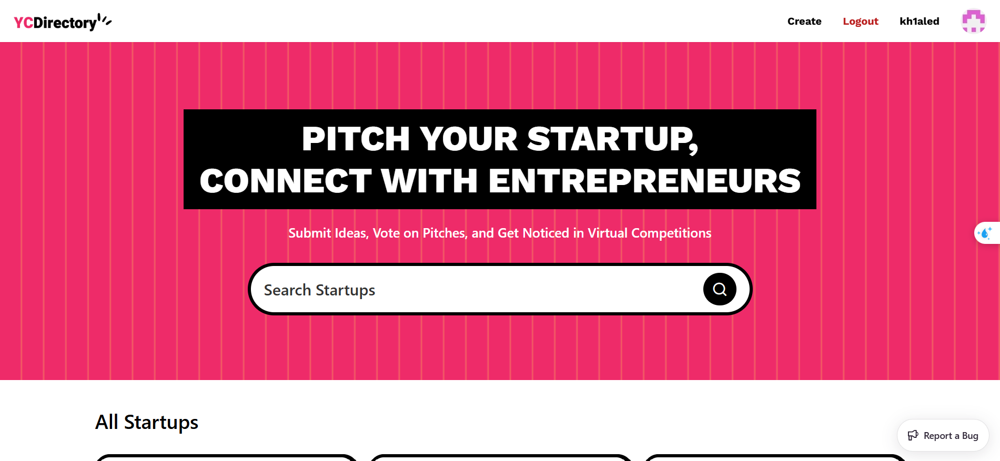

typescript nextdotjs tailwindcss sanity

Startup Directory Platform
Build this project step by step with me!
📋 Table of Contents
🤖 Introduction
⚙️ Tech Stack
🔋 Features
🤸 Quick Start
🕸️ Snippets (Code to Copy)
🔗 Assets
🚀 More
🚨 Tutorial
This repository contains the code corresponding to an in-depth tutorial available on our YouTube channel, JavaScript Mastery.

If you prefer visual learning, this is the perfect resource for you. Follow our tutorial to learn how to build projects like these step-by-step in a beginner-friendly manner!

🤖 Introduction
A Next.js 15 platform where entrepreneurs can submit their startup ideas for virtual pitch competitions, browse other pitches, and gain exposure through a clean minimalistic design for a smooth user experience.

If you're getting started and need assistance or face any bugs, join our active Discord community with over 34k+ members. It's a place where people help each other out.

⚙️ Tech Stack
React 19
Next.js 15
Sanity
TailwindCSS
ShadCN
TypeScript
🔋 Features
👉 Live Content API: Displays the latest startup ideas dynamically on the homepage using Sanity's Content API.

👉 GitHub Authentication: Allows users to log in easily using their GitHub account.

👉 Pitch Submission: Users can submit startup ideas, including title, description, category, and multimedia links ( image or video).

👉 View Pitches: Browse through submitted ideas with filtering options by category.

👉 Pitch Details Page: Click on any pitch to view its details, with multimedia and description displayed.

👉 Profile Page: Users can view the list of pitches they've submitted.

👉 Editor Picks: Admins can highlight top startup ideas using the "Editor Picks" feature managed via Sanity Studio.

👉 Views Counter: Tracks the number of views for each pitch instead of an upvote system.

👉 Search: Search functionality to load and view pitches efficiently.

👉 Minimalistic Design: Fresh and simple UI with only the essential pages for ease of use and a clean aesthetic.

and many more, including the latest React 19, Next.js 15 and Sanity features alongside code architecture and reusability

🤸 Quick Start
Follow these steps to set up the project locally on your machine.

Prerequisites

Make sure you have the following installed on your machine:

Git
Node.js
npm (Node Package Manager)
Cloning the Repository

git clone https://github.com/kh1aled/yc_direcotry.git
cd pitchify
Installation

Install the project dependencies using npm:

npm install
Set Up Environment Variables

Create a new file named .env.local in the root of your project and add the following content:

NEXT_PUBLIC_SANITY_PROJECT_ID=
NEXT_PUBLIC_SANITY_DATASET=
NEXT_PUBLIC_SANITY_API_VERSION='vX'
SANITY_TOKEN=

AUTH_SECRET= 
AUTH_GITHUB_ID=
AUTH_GITHUB_SECRET=
Replace the placeholder values with your actual Sanity credentials. You can obtain these credentials by signing up & creating a new project on the Sanity website.

Running the Project

npm run dev
Open http://localhost:3000 in your browser to view the project.

🕸️ Snippets
tailwind.config.ts
globals.css
lib/utils.ts
lib/validation.ts
components/Ping.tsx
PLAYLIST_BY_SLUG_QUERY
🔗 Assets
Fonts and Assets used in the project can be found here
Learn Server Actions
Applicaton Workflow
🚀 More
Advance your skills with Next.js Pro Course

Enjoyed creating this project? Dive deeper into our PRO courses for a richer learning experience. They're packed with detailed explanations, cool features, and exercises to boost your skills. Give it a go!